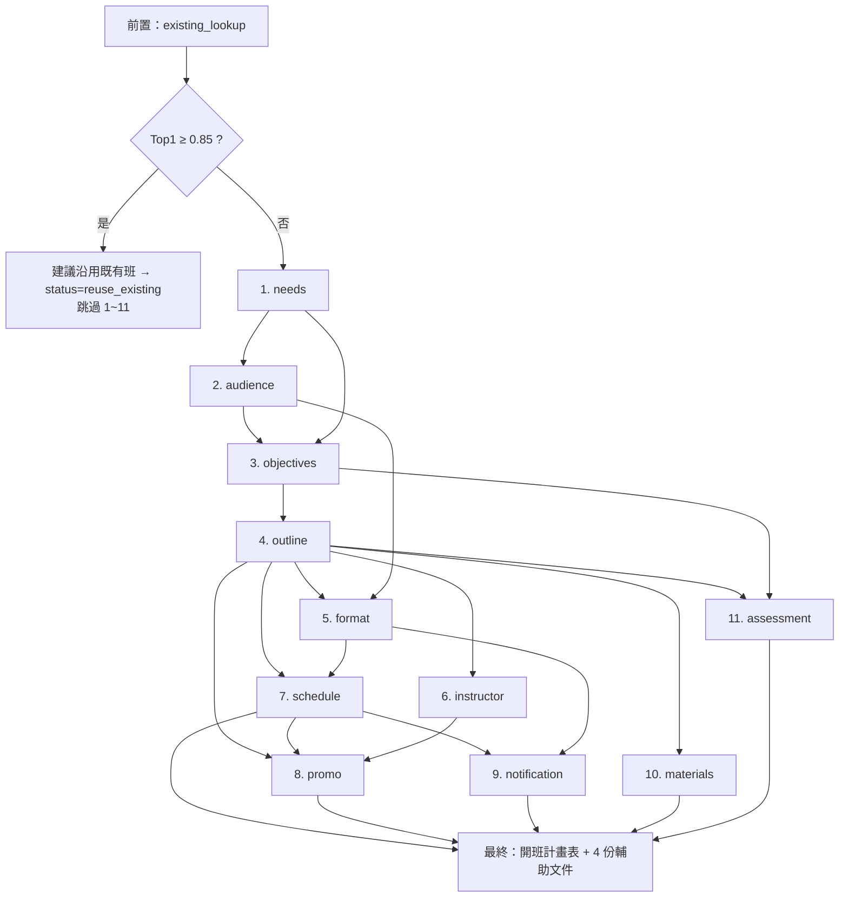

# 課程規劃幫手 v5（11 Skill 多 Agent 架構）

> 給維運者與後續 AI 助手：本文件是「課程規劃幫手」全新版（v5，2026/05 重做）的設計與實作參考。實作以程式碼為準，若文件與程式碼不一致，以 `src/lib/course-planner/` 與 `prisma/schema.prisma` 為準。

## 一、定位與設計理念

* **產出聖經**：中華電信學院「**開班計畫表**」草案。AI 只填思考性欄位（主題／目標／對象／預備知識／開班性質／報到地點／課程資源／課程資料／案由說明／學員課前提問），**組織特有欄位**（班代號、期數、體系別、領域分類、實際起訖、預調人數、教室）保留給培訓師手填、UI 上灰底標示。
* **多 Agent**：由 **11 個 Skill Agent** 組成 pipeline，前置一個「既有班相似度搜尋」步驟。每個 Skill 都會輸出 `reasoning + assumptions + confidence`，讓培訓師可以**驗證 AI 的判斷依據**。
* **避免學術腔**：以中華電信學院培訓師立場思考，**不使用 ADDIE / Bloom / Kirkpatrick** 等學術詞彙；改用務實白話。
* **既有班沿用優先**：相似度 ≥ 0.85 強烈建議沿用（跳過設計新班）；0.65~0.85 在側欄顯示「相似既有班參考」；< 0.65 完全當新班處理。
* **單一資料來源**：產出物完全用 Zod schema 驗證，可直接組成 `CoursePlanForm` 與 `AuxiliaryDocs`，不靠魔法字串。

## 二、Skill 一覽

| # | Skill 名稱 | 顯示名 | 種類 | 上游依賴 | 主要輸出 |
|---|---|---|---|---|---|
| — | `existing_lookup` | 既有班相似度搜尋 | 前置（非 LLM） | — | Top 5 相似既有班 + 決策（reuse / reference / new） |
| 1 | `needs` | 訓練需求分析 | form | — | `caseRationale`、`isTrainingProblem`、`capabilityGaps`、`nonTrainingActions` |
| 2 | `audience` | 學員輪廓分析 | form | needs | `targetAudience`、`prerequisites`、`notSuitableFor` |
| 3 | `objectives` | 學習目標設計 | form | needs, audience | `learningObjectives`（多 bullet，含每條對應的能力差距 id） |
| 4 | `outline` | 課程大綱設計 | form | objectives | `proposedClassName`、`modules`（一班 = N 堂課，每堂 `position/name/hours/type/description/linkedObjectiveIds`） |
| 5 | `format` | 課程形式選擇 | form | audience, outline | 13 個開班性質欄位（頻別／在職／直播／實體／是否簽到等）+ `checkInLocation` |
| 6 | `instructor` | 講師媒合（4 來源） | form | outline | 每堂課 `primaryInstructor` + `alternativeInstructors[]`，標註 `source: personal\|trainer\|history\|web\|ai_recommendation` |
| 7 | `schedule` | 課程時程規劃 | form | outline, format | 建議天數 × 每天時數、總時數、每堂排序 |
| 8 | `promo` | 課程文案 | aux | outline, schedule, instructor | 招生通知 markdown（標題／導言／亮點／報名資訊） |
| 9 | `notification` | 課前通知 | aux | schedule, format | email / LINE 文字 + 課前提問設計 |
| 10 | `materials` | 教材資源 | aux | outline | 教材清單（投影片／講義／範例檔／練習資料／本課程特色） |
| 11 | `assessment` | 課程評量 | aux | objectives, outline | 評量設計（實作任務／作業／專案／觀察表） |

實際線性執行順序（`SKILL_PIPELINE_ORDER`，`src/lib/course-planner/schemas/common.ts`）：

```
needs → audience → objectives → outline → format → instructor → schedule → materials → assessment → notification → promo
```

第二輪會做依賴圖平行化（依 `SKILL_UPSTREAM`），第一版先穩再快。

## 三、依賴圖



## 四、Skill → 開班計畫表 欄位對應表

`src/lib/course-planner/form-mapper.ts` 內 `buildAiFilled()` 把 11 Skill outputs 重組為 `CoursePlanForm.aiFilled`；`buildAuxiliaryDocs()` 重組 4 份輔助文件。

| 開班計畫表欄位（aiFilled） | 來源 Skill | 備註 |
|---|---|---|
| 主題（最終班名） | `outline.proposedClassName` | Skill 4 寫定，Skill 1 同步輸出工作標題（暫名） |
| 目標 | `objectives.learningObjectives` | 多 bullet，無學術詞 |
| 對象 | `audience.targetAudience` | |
| 不適合報名者 | `audience.notSuitableFor` | 對應圖內紅字區 |
| 預備知識 | `audience.prerequisites` | |
| 開班性質（13 欄） | `format.classNature.*` | 含頻別／在職／直播／實體／是否簽到… |
| 報到地點 | `format.checkInLocation` | 純直播 → 「線上連結（開課前 24h 寄送）」 |
| 課程資料（每堂課） | `outline.modules[]` × `instructor.assignments[]` × `schedule.sessions[]` | 一班 = N 堂；每堂可不同講師 |
| 課程資源（本課程特色） | `materials.classFeatures` | 對應圖內條列「課前 / 課中 / 課後」 |
| 案由說明 | `needs.caseRationale` | 直接抄到表上 |
| 學員課前提問設定 | `notification.preCourseQuestions` | 含「不收的原因」 |
| 總時數 | `schedule.totalHours` | = ∑ `outline.modules.hours` |

**完全不 AI 填**（`CoursePlanForm.manual`，UI 灰底）：班代號、期數、體系別、領域／課程分類、ESG／轉型／培訓構面／考證輔導旗標、實際起訖日期、各分公司預調人數、實體教室。

**輔助文件**（`AuxiliaryDocs`，獨立面板，不進開班計畫表）：

| 文件 | 來源 Skill | 用途 |
|---|---|---|
| 招生文案 | `promo` | EDM／網站文案，未來可一鍵送 EDM Generator |
| 課前通知 | `notification` | email／LINE 通知文字 + 課前提問 |
| 教材清單 | `materials` | 投影片／講義／範例檔／練習資料 |
| 評量設計 | `assessment` | 實作任務／作業／專案／觀察表 |

## 五、檔案結構

```
src/lib/course-planner/
  prompts/
    shared.ts                   # ROLE_PREAMBLE + REASONING_INSTRUCTION + JSON_OUTPUT_INSTRUCTION + buildSystemPrompt()
  schemas/
    common.ts                   # reasoningMixin + SKILL_NAMES + SKILL_DISPLAY_NAMES + SKILL_KIND + SKILL_UPSTREAM + SKILL_PIPELINE_ORDER
    form.ts                     # CoursePlanFormSchema + AuxiliaryDocsSchema + emptyCoursePlanForm() + emptyAuxiliaryDocs()
    needs.ts                    # NeedsInputSchema / NeedsOutputSchema
    audience.ts                 # AudienceInputSchema / AudienceOutputSchema
    objectives.ts               # ...
    outline.ts                  # ModuleSchema（每堂課）+ OutlineOutputSchema
    format.ts                   # ClassNatureSchema（13 欄）+ FormatOutputSchema
    instructor.ts               # InstructorAssignmentSchema + InstructorOutputSchema
    schedule.ts                 # SessionSchema + ScheduleOutputSchema
    promo.ts / notification.ts / materials.ts / assessment.ts
  skills/
    _base.ts                    # SkillDef<TIn,TOut> + runSkill() + loadSkillContext()
    needs.ts ~ assessment.ts    # 11 個 SkillDef（systemPrompt + buildUserMessage）
    index.ts                    # SKILLS map + getSkill()
  existing-class-lookup.ts      # 包裝 src/lib/similarity.ts，前置步驟（純函式，不呼 LLM）
  instructor-lookup.ts          # 4 純函式：lookupPersonalContacts / lookupTrainers / lookupHistoryInstructors / searchWebInstructors
  form-mapper.ts                # buildCoursePlanForm() + buildAiFilled() + buildAuxiliaryDocs() + mergeSkillOutputs()
  exporters.ts                  # toMarkdown() / toHtml() / toJson()
  upload-parser.ts              # parseUploadToText()（從 src/lib/planning/ 搬過來）
  orchestrator.ts               # async generator yield SSE 事件，串接 existing_lookup → 11 Skills

src/app/(main)/course-planner/
  page.tsx                                    # 入口頁（貼需求 + 上傳檔 + 啟動）
  [requestId]/page.tsx                        # 進度頁 + 開班計畫表編輯
  components/
    skill-timeline.tsx                        # 12 格時間軸
    skill-detail.tsx                          # 點開時間軸格時顯示 reasoning + JSON
    existing-class-panel.tsx                  # 既有班建議面板
    course-plan-form-view.tsx                 # 仿開班計畫表版型，AI 區白底可編，手動區灰底
    auxiliary-docs-panel.tsx                  # 4 份輔助文件 tabs
    draft-versions-panel.tsx                  # 版本列表 + 切換 + 快存

src/app/api/course-planner/
  requests/route.ts                           # POST 建 / GET 列
  requests/[id]/route.ts                      # GET / PATCH / DELETE
  requests/[id]/run/route.ts                  # POST SSE：跑前置 + 11 Skills
  requests/[id]/skills/route.ts               # GET 所有 SkillRun
  requests/[id]/skills/[name]/run/route.ts    # POST SSE：重跑單一 Skill + 下游
  requests/[id]/draft/route.ts                # GET 列版本 / POST 存新版本 / PATCH 快存
  requests/[id]/export/route.ts               # POST 匯出 (md / html / json / docx)
  requests/[id]/existing-classes/route.ts     # GET 既有班搜尋
  upload-parse/route.ts                       # POST 檔案解析
```

## 六、資料庫 schema

`prisma/schema.prisma` 共三個 model（v1 的 `PlanningRequest` / `PlanningDraft` 已刪）：

| 模型 | 欄位重點 |
|---|---|
| `CoursePlanRequest` | `id` / `createdBy` / `title?` / `rawInputText` / `sourceFiles?` / `status` (`pending`/`running`/`completed`/`reuse_existing`/`failed`) / `currentSkill?` / `reuseClassId?` / `finalForm?` (Json) / `finalAuxDocs?` (Json) |
| `CoursePlanSkillRun` | `requestId` / `skillName` / `sequence` (重跑遞增) / `input` / `output` / `reasoning` / `status` / `error?` / `durationMs` / `model` |
| `CoursePlanDraft` | `requestId` / `versionNo` / `formJson` / `auxDocsJson?` / `changeNote?` / `createdBy` |

`User` model 反向關聯：`coursePlanRequests` / `coursePlanDrafts`。

## 七、Skill 執行核心抽象（`skills/_base.ts`）

`runSkill(def, input, ctx)` 統一處理：

1. **強制 reasoning 欄位**：每個 SkillOutput schema 都 extend `reasoningMixin`（reasoning + assumptions + confidence），prompt 強制要求說明判斷依據。
2. **嚴格 Zod 驗證**：LLM 回 JSON 後 `outputSchema.parse()`，失敗自動帶錯重試一次。
3. **OpenAI / Gemini 雙供應商相容**：兩家都吃 `response_format: { type: "json_object" }`（Gemini OpenAI-compat v1beta 也支援）；Schema 描述用 `describeZodSchema` 轉 TypeScript 介面文字塞進 user prompt，降低漏欄位機率。
4. **AI 技能脈絡注入**：每次呼叫前 `loadCachedSkillContext(userId, ...)`（in-memory cache，TTL 5 分鐘；同一 pipeline 11 次呼叫只打 1 次 DB），自動帶入 `course_planning` 與所有 `planning_skill_*` 全院規範 + 登入者個人脈絡。Admin / 個人脈絡更新時會呼 `invalidateSkillContextCache()` 清掉。
5. **DB 紀錄**：每次執行寫入 `CoursePlanSkillRun`，含 input / output / reasoning / durationMs / model，支援單獨重跑（`sequence + 1`）。
6. **429 退避重試**：最多 5 次指數退避（3s → 8s → 15s → 30s → 60s）。連續失敗時 throw `friendly429`（中文錯訊息含 quota 重置時間建議與切換 API key 步驟）。
7. **Input-hash cache**：開頭計算 `sha256(stableStringify(input))` 與最近 5 筆成功 run 的 input hash 比對；命中即回傳上次 output，**完全不打 LLM、不新增 SkillRun row**。`forceRerun: true` 可繞過。
8. **Surface 旗標**：回傳 `cached?: boolean`、`hit429?: boolean`，由 orchestrator 用來在 SSE 事件加 `cached/hit429` 提示，並動態調整下一個 Skill 的間隔（連續 429 → 間隔指數放大，cap 30s；走 cache → 間隔砍 0）。

## 八、特殊 Skill 設計

### Skill 6 講師媒合（4 來源）

不重新走 Agent tool 路徑（會多一層 LLM tool-call）。`src/lib/course-planner/instructor-lookup.ts` 把 [src/lib/agent/tools/instructor-search.ts](../src/lib/agent/tools/instructor-search.ts) 的 DB 查詢抽成 4 純函式：

```ts
lookupPersonalContacts(userId, keyword, limit)   // 個人師資人脈（PersonalInstructorContact）
lookupTrainers(keyword, limit)                   // 培訓師名冊（TisTrainer + ClassPlanInstructor）
lookupHistoryInstructors(keyword, limit)         // 歷史授課（TrainingClass.lecturers）
searchWebInstructors(keyword)                    // 只在 OpenAI 模式 + supportsBuiltInWebSearch 時走 web_search_preview
```

執行流程：

1. 接收 Skill 4（outline）的 modules 列表
2. 對每個 module name 跑 4 來源（前 3 個查 DB、第 4 個查網路）
3. 把 4 來源結果放進 LLM prompt，請 LLM 為每堂課產出「主推 1 位 + 備選 2 位」並寫 reasoning
4. 輸出 schema 含每堂課 `primaryInstructor` + `alternativeInstructors`，每位都標註 `source: personal | trainer | history | web | ai_recommendation`

Gemini 模式 `supportsBuiltInWebSearch` 為 false，網路來源會回空陣列，並在 reasoning 標註「未做網路搜尋」。

### Skill 4 課程大綱（一班 = N 堂課）

每堂課 schema：

```ts
{
  position: number,                  // 1, 2, 3, 4
  name: string,                      // 「認識 Google AI Studio」
  hours: number,                     // 2.0
  type: "lecture" | "exercise" | "discussion" | "case_study" | "project",
  description: string,
  linkedObjectiveIds: number[],      // 對應 Skill 3 的 objective.id
}
```

不寫 `conceptRatio` / `practiceRatio`（v2 學術腔），改用 `type` 列舉。「課堂課程代碼」（CR25AG…）由培訓師手填，AI 不參與。

### 前置：既有班搜尋

`src/lib/course-planner/existing-class-lookup.ts`：

1. 用 `rawInputText` 走 [src/lib/embedding.ts](../src/lib/embedding.ts) 產生 query 向量
2. 呼 `computeSimilarityV4` 查 Top 5
3. **REUSE_THRESHOLD = 0.85**：Top 1 ≥ 0.85 → orchestrator 中止 pipeline，UI 顯示 `ExistingClassPanel`，培訓師可選「沿用」（`status = reuse_existing`）或「我要設計新班」（繼續）
4. **REFERENCE_THRESHOLD = 0.65**：Top 1 在 0.65 ~ 0.85 → 在側欄顯示「相似既有班參考」，pipeline 照常走，相似班的 className 會出現在 LLM prompt 當命名靈感
5. < 0.65 → 完全當新班處理
6. **In-memory LRU cache**：相同 `rawInputText` 1 小時內命中即省一次 embedding API 呼叫 + 全表 similarity 計算（`COURSE_PLANNER_LOOKUP_CACHE_TTL_MS` 可調，0 = 關閉）。班次匯入完成會呼 `invalidateExistingClassLookupCache()` 立即失效。

### Token / 配額省料策略總覽（2026/05 第二輪優化）

| 機制 | 位置 | 效果 |
|---|---|---|
| Input-hash DB cache | `runSkill` | 同 request 重跑 input 不變 → 0 token |
| Output pruner | `output-pruner.ts` + orchestrator instructor case | candidatesPerSession 各來源 cap 3 位 → instructor input -50~70% token |
| Skill context in-memory cache | `loadCachedSkillContext` (TTL 5 min) | 11 次 DB 讀 → 1 次 |
| Existing-class LRU cache | `findSimilarExistingClasses` (TTL 1 hr) | 相同需求文字省 1 次 embedding API call |
| 動態 Skill 間隔 | `orchestrator.ts` (連續 429 指數放大、cache hit 砍 0) | 平順時 4.5s 維持 13 RPM；爆 429 時放慢；走 cache 一次清光 backlog |
| 重跑前確認對話 | `/skills/[name]/check-rerun` + `SkillDetail` | 上游沒動過時提示「上次結果還在，要強制重跑嗎？」避免無腦 force |

## 九、API 端點

| 方法 | 路徑 | 說明 |
|---|---|---|
| `POST` | `/api/course-planner/requests` | 建立新 `CoursePlanRequest`（body：`title?`、`rawInputText`、`sourceFiles?`） |
| `GET` | `/api/course-planner/requests` | 列出登入者的近期 requests |
| `GET` | `/api/course-planner/requests/[id]` | 取單一 request（含 `finalForm`、`finalAuxDocs`） |
| `PATCH` | `/api/course-planner/requests/[id]` | 更新 `title` / 設 `reuseClassId` / 改 `status=reuse_existing` |
| `DELETE` | `/api/course-planner/requests/[id]` | 刪除 |
| `POST` | `/api/course-planner/requests/[id]/run` | **SSE**：跑前置 + 11 Skills，串流 `existing_classes_found` / `skill_start` / `skill_complete` / `complete` |
| `GET` | `/api/course-planner/requests/[id]/skills` | 列出該 request 所有 `CoursePlanSkillRun`（每 skillName 取最新 sequence） |
| `POST` | `/api/course-planner/requests/[id]/skills/[name]/run` | **SSE**：重跑單一 Skill + 自動帶下游所有 Skill（body 可帶 `forceRerun: true` 跳過 input-hash cache） |
| `GET` | `/api/course-planner/requests/[id]/skills/[name]/check-rerun` | 查上次 success run 是否還在、上游從那之後是否動過 → 給 UI 決定是否顯示「強制重跑嗎？」確認對話 |
| `GET` | `/api/course-planner/requests/[id]/draft` | 列出所有 `CoursePlanDraft` 版本 |
| `POST` | `/api/course-planner/requests/[id]/draft` | 存新版本（body：`formJson`、`auxDocsJson?`、`changeNote?`），`versionNo` 自動 +1 |
| `PATCH` | `/api/course-planner/requests/[id]/draft` | 快存：直接覆寫 `CoursePlanRequest.finalForm` / `finalAuxDocs`（不增版號） |
| `POST` | `/api/course-planner/requests/[id]/export` | 匯出（query：`format=markdown\|html\|json\|docx`） |
| `GET` | `/api/course-planner/requests/[id]/existing-classes` | 取既有班搜尋結果（reuse / reference / new + Top 5） |
| `POST` | `/api/course-planner/upload-parse` | 上傳檔案 → 純文字（支援 .txt / .docx / .pdf / .xlsx / .csv） |

### SSE 事件格式（orchestrator）

```ts
type OrchestratorEvent =
  | { type: "existing_classes_found"; decision: "reuse" | "reference" | "new"; top5: ExistingClassMatch[] }
  | { type: "reuse_decision_required"; topClass: ExistingClassMatch }     // 需培訓師選沿用 / 設計新班
  | { type: "skill_start"; skill: LlmSkillName; sequence: number }
  | { type: "skill_complete"; skill: LlmSkillName; output: unknown; reasoning: string; durationMs: number; cached?: boolean; hit429?: boolean }
  | { type: "skill_failed"; skill: LlmSkillName; error: string }
  | { type: "complete"; finalForm: CoursePlanForm; finalAuxDocs: AuxiliaryDocs }
  | { type: "error"; message: string };
```

## 十、UI 流程（`/course-planner`）

頁面三大區塊：

1. **左側 `SkillTimeline`**：12 格（前置 1 + LLM Skills 11），每格顯示 `pending / running / success / failed`，點擊可看 reasoning + 完整 output JSON。`failed` 與 `success` 都可點「重跑」（自動帶下游）。
2. **中間 `CoursePlanFormView`**：仿開班計畫表版型。`aiFilled` 區白底可內聯編輯（編輯後可「快存」或「儲存為新版本」）；`manual` 區灰底待手填（不存 `finalForm`，僅 UI 占位）。
3. **右側面板**（依狀態切換）：
   * `ExistingClassPanel`（pipeline 跑前 / 跑中、有既有班建議時）
   * `AuxiliaryDocsPanel`（4 份輔助文件 tabs：promo / notification / materials / assessment）
   * `DraftVersionsPanel`（版本列表 + 切換 + 載入）

## 十一、AI 技能脈絡（slug）

[`prisma/default-global-ai-skills-data.ts`](../prisma/default-global-ai-skills-data.ts) 定義以下與課程規劃相關的 slug，會自動注入每個 Skill 的 LLM prompt：

| slug | 用途 |
|---|---|
| `course_planning` | 全 pipeline 通用：避免 ADDIE/Bloom/Kirkpatrick 學術詞、強制 reasoning + assumptions + confidence、保守判斷 |
| `instructor_search` | Skill 6 媒合用：4 來源優先序、reasoning 內容要求 |
| `classroom` | Skill 5 / Skill 9 用：報到地點與線上連結文字慣例 |
| `schedule` | Skill 7 用：每天時數上限、跨日常識 |
| `planning_skill_needs` | Skill 1 細節：症狀 vs 能力差距、`isTrainingProblem`、`caseRationale` |
| `planning_skill_audience` | Skill 2 細節：targetAudience / prerequisites / notSuitableFor 撰寫風格 |
| `planning_skill_objectives` | Skill 3 細節：學習目標寫法（避免 Bloom 動詞表） |
| `planning_skill_outline` | Skill 4 細節：一班 N 堂、type 列舉、linkedObjectiveIds |
| `planning_skill_format` | Skill 5 細節：13 欄開班性質決策樹 |
| `planning_skill_instructor` | Skill 6 細節：每堂主推 + 備選、source 標註 |
| `planning_skill_schedule` | Skill 7 細節：天數 × 每天時數合理範圍 |
| `planning_skill_promo` | Skill 8 細節：招生通知 markdown 風格 |
| `planning_skill_notification` | Skill 9 細節：email + LINE + 課前提問 |
| `planning_skill_materials` | Skill 10 細節：投影片／講義／範例檔／練習資料分類 |
| `planning_skill_assessment` | Skill 11 細節：實作任務 / 作業 / 專案 / 觀察表 |

[`src/lib/ai-skills.ts`](../src/lib/ai-skills.ts) 內：

```ts
export const PLANNING_INCLUDED_GLOBAL_SLUGS = ["course_planning", "instructor_search", "classroom", "schedule"] as const;
export const PLANNING_INCLUDED_SLUG_PREFIXES = ["planning_"] as const;
```

`runSkill()` 會用這兩份併出 prompt append 注入。新增 `planning_*` slug 不需要改程式，自動被吃進來。

## 十二、AI 供應商（多供應商支援，2026/05 第三輪優化）

`src/lib/ai-provider.ts` 三家 OpenAI-compat 都接：

| Provider | 預設模型 | 特色 | API key env | Base URL env |
|---|---|---|---|---|
| `gemini` | `gemini-2.5-flash` | 中文佳、Free 250 RPD | `GEMINI_API_KEY` | `GEMINI_BASE_URL` |
| `groq` | `llama-3.3-70b-versatile` | 速度極快、Free ~1000 RPD | `GROQ_API_KEY` | `GROQ_BASE_URL` |
| `openai` | `gpt-4o-mini` | 穩定、需付費 | `OPENAI_API_KEY` | `OPENAI_BASE_URL` |

**為什麼建議全 Skill 用同一家**：跨 Skill 切供應商會造成中文風格、列點密度、reasoning 長度斷層，最終開班計畫表會像被兩個人接力寫。整個 request 鎖定一家即可。

### 解析優先序（功能 × 供應商）

```
provider = options.provider               // 呼叫端硬性指定（API route 從 DB 讀）
        ?? CoursePlanRequest.aiProvider   // 該 request 的 DB 欄位
        ?? COURSE_PLANNER_AI_PROVIDER     // 課程規劃幫手專用 env
        ?? AI_PROVIDER                    // 全站預設
        ?? "openai"

model    = options.model
        ?? COURSE_PLANNER_AI_MODEL        // 跨供應商通用模型 env
        ?? {GEMINI|OPENAI|GROQ}_MODEL_PLANNING
        ?? {GEMINI|OPENAI|GROQ}_MODEL
```

### UI 切換點

* **建新 request 時**：入口頁的「AI 執行引擎」下拉，存進 `CoursePlanRequest.aiProvider`
* **跑完後想換家重跑**：詳情頁右上「執行引擎」下拉（PATCH `/requests/[id]`），切換後下次重跑生效
* **跑 pipeline 中**：select 會 disabled，避免跑到一半換家造成風格斷層

### 為什麼不做「自動 429 切換」（暫定）

技術上可行（在 `runSkill.callWithRetry` 偵測 429 後切 client/model），但：

1. **Pipeline 中切換 = 風格斷層**：Skill 1-5 用 Gemini、Skill 6 突然 Groq → 中文風格、reasoning 長度立刻不同
2. **「無痕」反而難 debug**：使用者看到品質掉、變慢，找不到原因
3. **規模做法**：應該在 request 層級切換（整個 request 同一家），需要前置探測或上次 429 時間戳

**目前先做手動切換 + 詳情頁可重新指定**（觀察一週後再決定是否加 request 層級失敗切換）。

## 十三、技術選型決策

| 抉擇 | 決定 | 理由 |
|---|---|---|
| AI SDK | 沿用瑞士刀現有 `openai` SDK + 自寫 JSON 解析（`createAiClient`） | 避免大改技術棧；未來想升級可單檔替換 `_base.ts` |
| 結構化輸出 | Zod schema + LLM prompt 強制 JSON + 解析重試一次 | 三家都吃 `response_format: json_object` |
| 串流 | SSE（不用 Vercel AI SDK 的 `createUIMessageStream`） | 與 `/api/agent/chat` 模式一致 |
| 平行化 | 第一版順序執行，第二輪做依賴圖排程 | 先穩再快 |
| 多供應商 | per-request `aiProvider` 欄位 + per-feature env | 各功能可獨立切換、整個 request 一致 |

## 十四、未來擴充

* **平行化排程**：依 `SKILL_UPSTREAM` 做拓樸排序，可平行的 Skill 同時跑（例如 outline 完成後 instructor / format / materials / assessment 可平行）
* **EDM Generator 整合**：Skill 8 招生文案 → 一鍵送 [`/tools/edm-generator`](../src/app/(main)/tools/edm-generator/) 帶入
* **班次詳情頁整合**：從 [`TrainingClass`](../prisma/schema.prisma) 一鍵建立 `CoursePlanRequest`（用該班的 `description` 當 `rawInputText`）
* **TIS 即時拉既有班**：目前用瑞士刀 DB 內已匯入的 `TrainingClass`；TIS API 可用後改為即時查詢

## 十五、風險與注意事項

* **11 Skill 全跑延遲**：保守估算 60–120 秒（每 Skill 6–12 秒）。SSE 推進度可緩解感受；超過 120s 就要切平行化（第二輪）。
* **Gemini 結構化輸出穩定度**：v1 已踩過坑，靠 markdown 區塊抓取 + 二次重試；新版沿用同模式。
* **Skill 6 web_search 限制**：`supportsBuiltInWebSearch` 目前只在 OpenAI；Gemini / Groq 模式 Skill 6 只走前 3 來源 + AI 推薦，並標註「未做網路搜尋」。
* **預設 slug 的占位內容**：[`prisma/default-global-ai-skills-data.ts`](../prisma/default-global-ai-skills-data.ts) 已更新為 11 Skill 的語境，但 admin 可在 `/settings/ai-skills` 自由覆寫（建立新版本）。
* **跨供應商風格差異**：同一個 request 鎖定一家，但不同 request 之間若用不同家，培訓師會感覺到中文風格、reasoning 長度差異。需要時可在 prompt 內加更明確的風格指示。

---

**相關文件**：

* [README.md 模組 B](../README.md#模組-b課程規劃幫手v5-全新版--11-skill-多-agent-架構)
* [docs/AI_SKILLS_CONTEXT.md](AI_SKILLS_CONTEXT.md)：技能脈絡注入機制
* [docs/TIS_TRAINING_CLASS_ALIGNMENT.md](TIS_TRAINING_CLASS_ALIGNMENT.md)：既有班來源（`TrainingClass`）的欄位定義
